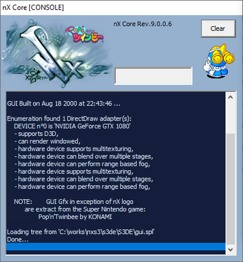
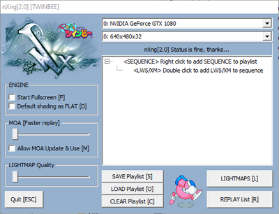
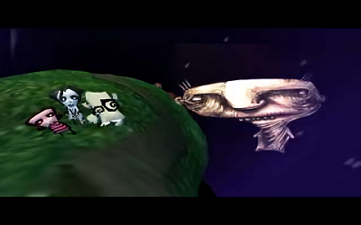
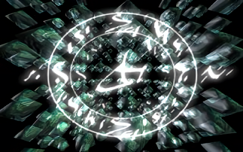
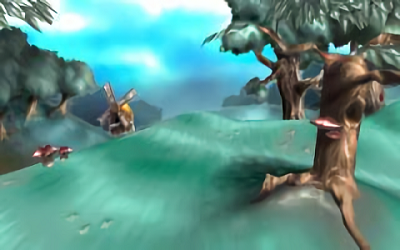
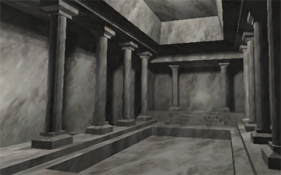
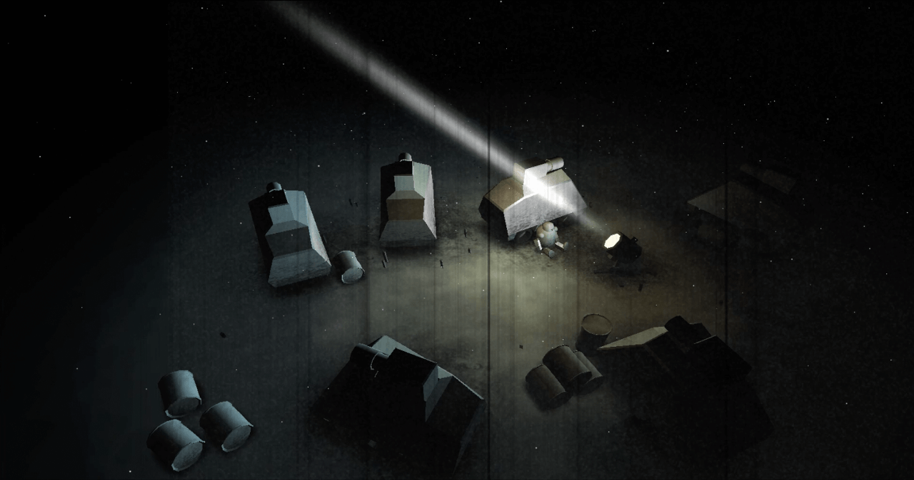

# nXng
The Syndrome 3D engine

:warning: This is LEGACY software. This source code is shared for historical purposes. 
_The C++ source is most probably incomplete._

## nXng by [Emmanuel JULIEN](https://github.com/ejulien/), 1999~2000 
 

 

## Table of Content

1) About
1) Rules and Things to know
1) Restrictions and loosy stuff
1) Major features
1) The Replay engine and MOA

## About

nXng is a NEWTEK's Lightwave based demo 3D-Engine. It barely works like any other 3D-Engine.

It is pure software 3d-engine. Transformations/clippings/lightning are hand written the only calls made to D3D when using hardware rasterizer are SETRENDERSTATE and DRAWPRIMITIVE.

### Demos that use nX

- Dash (Condense) uses x3 (https://www.pouet.net/prod.php?which=91)
- LTP3 Intro-Invitation (Syndrome) uses X32 (https://www.pouet.net/prod.php?which=53)
- FreeStyle (Condense & Syndrome) uses nX (https://www.pouet.net/prod.php?which=8)
- Couloir 14 uses nXng (https://www.pouet.net/prod.php?which=3054)

### Requirements

- Pentium class processor (MMX is NOT a plus),
- DirectX 7.0 with at least a DirectX compatible graphic card,

### Legacy screenshots

 

 

## RULES AND THINGS TO KNOW

- gAudio MP3 Library is available for FREE non-commercial use here: http://www.idf.net/gods
- A scene !MUST NOT! have any of its objects first appearing with this motion step:
  - Position X, Y & Z: -9999999999,123456 m
  - Angle H, P & B: -9999999999,123456 °
  - Scale X, Y & Z: -9999999999,123456 *
  - If you fail to respect this rule then nX behavior is not predictable! (even if there is only one chance on infinity you make this ! (8)
- !!! There are reserved keywords in surface's name !!!:
  - See the SETTING UP THE SURFACE SHADERS section for a complete list.
- TEXTURE REPEAT is VERY IMPORTANT!
  - nX will surely crash if you intend to wrap a texture without setting the appropriate
  - Surface's flag !!! BEWARE ALSO specifying texture wrap when unused is a MEMORY HOLE !!!
  - In order to wrap texture with software renderer nX must stretch EACH wrapping textures to 256x256 ! (You might sometimes want to use this option to increase linear mapper precision but I really do not recommand doing random wrapping settings!)
  - NOTE : This does not apply when rendering via Direct3D.
- Throughout this document MOA will be refered to as motion overdrawing
- If you find some problems with truemap textured D3D surfaces or flashing/jerky lightning, try another scene size!
- There is NO clipping bugs. Disappearing polygons are because of MOA being calculated every 8 frames, if you want no replay bug then update MOA in 1x mode <but have a good night then (;>,
- MOA SHOULD BE updated whenever the scene changes BUT sometimes nX won't detect scenes changes and this may result in HEAVY PLAYBACK BUGS! In this case just check the 'update MOA' option.
- Last but not least : try to catch an AMIGA and get a life.
  
## RESTRICTIONS AND LOOSY STUFF

- Supported texture formats are in prefered order TARGA, JPEG, BMP and IFF.
  - TARGA, BMP and IFF code are originals. JPEG is based on IJG distribution.

- When using precalculated motion the number of face in scene must not exceed 65535,
	
- Texture width is limited to 256x256 pixels in ALL rendering type IF wrapping otherwise specify [WM] in surface name to activate wide map support for surface (upto 65535x65535).
  - WARNING!: Wide texture repeat WILL crash!
  - But any size lower than 256x256 is allowed (even non-2^x size) with wrapping,
  - Direct3D has hardware texture size limitation (accelerator dependent).
  - Note: A 1024x1024 texture fill upto 4mo! think about it and don't even think about CPU-caching datas (;
    - If a rendering type does not have WIDE support you'll get a warning at load time.
- Because of the way nX calculate UV mapping coordinate, the LIGHTWAVE's texture velocity behavior cannot
 be reproduced. Only x and y component are took in account and added to u and v texture components.
  - i.e: if you specify an x velocity of 1.0 then the texture seen from front will scroll left because its U (x in texture space) will be increased each frame.
  
## MAIN FEATURES

- Engine
  - Internal RGB888 routines,
  - Full Float32 FPU 3D calculations,
  - Light color support for all types,
  - Fully independent texture levels (center, size & velocity),
  - Scalable and morphable particle objects,
  - Dynamic shading based upon all lights in scene,
  - Fully parametrable lightning models on a per-surface basis,
    (specified by keyword 'LGT_x[+x][+...]' in surface name -G3E compatible-)
    NOTE : specifying LGT is only needed when restricting surface lightning to specific lights,
  - Diffuse and Specular percentage variable,
  - Specular and Glossiness pow support for all shaded rendering methods,
  - Extra texture effects for all rendering type,
  - Lightning speed load engine (even faster than Lightwave!),
  - Works both windowed/fullscreen either soft or d3d.
- Lightwave functions compatibility level
   - 'Planar image map', 'Cubic image map', 'Cylindrical image map' support,
   - LIGHTWAVE's 'MetaMorph' support (vertices + normals),
   - MORPH-GIZMO (extension to metamorph for multiple targets),
   - Alpha transparency (256 levels for both software & hardware),
   - Object dissolve fully supported (correctly affect transparency),
   - Transparency texture level support,
   - LIGHTWAVE's 'MaxSmoothingAngle' support,
   - Camera focal envellop,
   - Support for unlimited lights: (with all envellop supported including cone angle&edge angle ones)
      - Ambient light intensity,
      - Distant Light,
      - Point Light,
      - Spot light,
      - Lens flare support.
   - Null object,
   - Inverse Kinematik (but not ala Lightwave so it is quite unusable for now),
   - Parent objects,
   - Target object,
   - Scale and pivot point,
   - Support motion/envelop End Behavior (Reset is interpreted as Stop),
- Extra functions
   - Fully configurable spark emiters
- Software rasterizer
   - Polygonal rasterizer/clippers (up to 333 edges),
   - Sub-pixel/Sub-texel accurate polydrawer with FLOAT32 precision,
   - GENERIC SOFTWARE RASTERIZER
      - Software has support for ALL render types!
      - Just try MAPPING + EVMAP + BUMP + ALPHA TEXTURE + ADDITIVE + GOURAUD it WORKS! (((:
      - plus 30 custom optimized cases (most common ones).
   - Software colored linear fog,
   - Software selective Z-Buffer (32 bits), must specify '[ZBUFFER]' in surface name to activate,
   - Texture Width & Height wrapping (UV Wrap),
- D3D rasterizer
   - Uses the texture management feature of D3D (DirectX 6+),
   - ZBuffer automatically select largest Zbuffer type available,
   - CAPS based rendering taking advantage of multipass/multitexture capable accelerators,
  
## THE REPLAY ENGINE AND MOA

The precalculation works by previewing faces visibility for the whole motion (so you must recompute
the full precalculation as soon as you change any scene' entity motion). As the precalculation allows a
GREAT speed improvement an option allows user to select precalculation precision so that you can use
it at any time you try a scene. OF COURSE, the less precision you set the more glitches you'll get during
playback! As a rule you should only use x8 motion analysis for previewing scenes and final compilation
should be done with HI precaprec. Preca precision bugs often appears as missing polygons ...
 
ONE VERY IMPORTANT THING TO REMEMBER IF YOU WISH TO GET MAXIMUM PROFIT FROM PRECALCULATION!: 
Always split your worlds/scenes in different objects. No matter if instead of one big static world
you get 32 moving parent objects (or whatever more complex things you wish) the replay using preca will
ALWAYS be FAR faster (except if you always see all objects at once (: ) bcoz the precalculation permits
X32 to skip non-visible objects without even doing 1 mul for the object! {-8*
